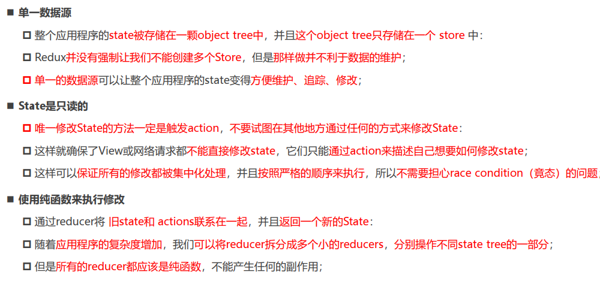

# redux

* **redux中基础概念**

1. store：是一个存储state的对象，可以跟踪数据的变化。
2. action：redux要求通过action来更新数据。所有数据的变化必须通过`dispatch` action 来更新数据；另外action是一个普通的js对象，用来描述更新的type和内容。
3.reducer：reducer是一个纯函数，它将传入的state和action结合起来生成一个新的state。

* **基本使用**

```js
const { createStore } = require('redux')

// 初始的数据  这个数据只会使用一次
const initstate = {
    name: 'Cooper',
    counter:0
}

// 定义reducer
// 每次返回应该是上一个state
function reducer(state =initstate ,action) {
    return state
}

// 创建store
const store = createStore(reducer)

// 数据的获取
console.log(store.getState());
```

* **状态的修改**

```js
const { createStore } = require('redux')

// 初始的数据  这个数据只会使用一次
const initstate = {
    name: 'Cooper',
    counter: 0
}

// 定义reducer
// 每次返回应该是上一个state
function reducer(state = initstate, action) {
    switch (action.type) {
        case 'change_name':
            return { ...state, name: action.name }  // 这里要返回一个新的对象，否则的话页面将不会更新数据
        default:
            return state
    }
}

// 创建store
const store = createStore(reducer)


// 数据的获取
console.log(store.getState());  // {name: 'Cooper',counter:0}

const nameAction = { type: 'change_name', name: '张三' }
store.dispatch(nameAction)  //每次dispatch内部会再一次执行reducer函数

console.log(store.getState());  // {name: '张三',counter:0}
```

* **订阅state的变化**

```js
const { createStore } = require('redux')

// 初始的数据  这个数据只会使用一次
const initstate = {
    name: 'Cooper',
    counter: 0
}

// 定义reducer
// 每次返回应该是上一个state
function reducer(state = initstate, action) {
    switch (action.type) {
        case 'change_name':
            return { ...state, name: action.name }  // 这里要返回一个新的对象，否则的话页面将不会更新数据
        default:
            return state
    }
}
// 创建store
const store = createStore(reducer)
// 数据的获取
const nameAction = { type: 'change_name', name: '张三' }
const nameAction2 = { type: 'change_name', name: '李四' }

const unsubscribe = store.subscribe(() => {
    console.log('state变化了');   // 每次dispatch state变化时执行该函数
})

store.dispatch(nameAction)  //每次dispatch内部会再一次执行reducer函数

unsubscribe()  // 取消订阅

store.dispatch(nameAction2)  //每次dispatch内部会再一次执行reducer函数
```

* **动态生成action**

封装成一个函数，在项目时可以定义一个actionCreator文件夹

```js
const { createStore } = require('redux')

// 初始的数据  这个数据只会使用一次
const initstate = {
    name: 'Cooper',
    counter: 0
}

// 定义reducer
// 每次返回应该是上一个state
function reducer(state = initstate, action) {
    switch (action.type) {
        case 'change_name':
            return { ...state, name: action.name }  // 这里要返回一个新的对象，否则的话页面将不会更新数据
        default:
            return state
    }
}
// 创建store
const store = createStore(reducer)
// 数据的获取
// const nameAction = { type: 'change_name', name: '张三' }
// const nameAction2 = { type: 'change_name', name: '李四' }

function actionCreator(name) {
    return {
        type: 'change_name',
        name
    }
}

const unsubscribe = store.subscribe(() => {
    console.log('state变化了');   // 每次dispatch state变化时执行该函数
})

store.dispatch(actionCreator('张三'))  //每次dispatch内部会再一次执行reducer函数

unsubscribe()  // 取消订阅

store.dispatch(actionCreator('李四'))  //每次dispatch内部会再一次执行reducer函数

```

* **redux 文件夹划分**

  * `src/`
    * `store/`
      * `actionCreator.js`
      * `constant.js`
      * `index.js`
      * `reducer.js`

* **redux 原则**



* **react中使用redux**

