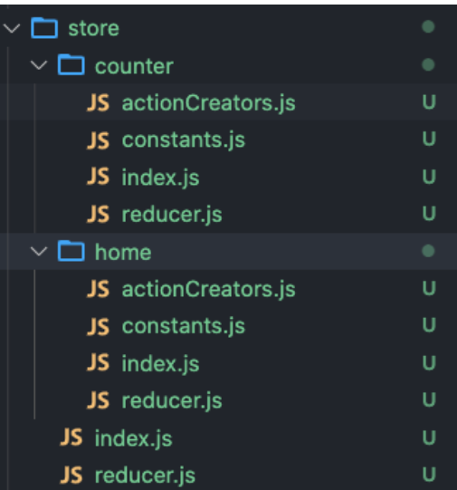
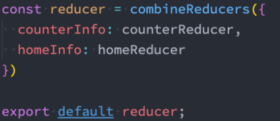

# redux

* **redux中基础概念**

1. store：是一个存储state的对象，可以跟踪数据的变化。
2. action：redux要求通过action来更新数据。所有数据的变化必须通过`dispatch` action 来更新数据；另外action是一个普通的js对象，用来描述更新的type和内容。
3.reducer：reducer是一个纯函数，它将传入的state和action结合起来生成一个新的state。

* **基本使用**

```js
const { createStore } = require('redux')

// 初始的数据  这个数据只会使用一次
const initstate = {
    name: 'Cooper',
    counter:0
}

// 定义reducer
// 每次返回应该是上一个state
function reducer(state =initstate ,action) {
    return state
}

// 创建store
const store = createStore(reducer)

// 数据的获取
console.log(store.getState());
```

* **状态的修改**

```js
const { createStore } = require('redux')

// 初始的数据  这个数据只会使用一次
const initstate = {
    name: 'Cooper',
    counter: 0
}

// 定义reducer
// 每次返回应该是上一个state
function reducer(state = initstate, action) {
    switch (action.type) {
        case 'change_name':
            return { ...state, name: action.name }  // 这里要返回一个新的对象，否则的话页面将不会更新数据
        default:
            return state
    }
}

// 创建store
const store = createStore(reducer)


// 数据的获取
console.log(store.getState());  // {name: 'Cooper',counter:0}

const nameAction = { type: 'change_name', name: '张三' }
store.dispatch(nameAction)  //每次dispatch内部会再一次执行reducer函数

console.log(store.getState());  // {name: '张三',counter:0}
```

* **订阅state的变化**

```js
const { createStore } = require('redux')

// 初始的数据  这个数据只会使用一次
const initstate = {
    name: 'Cooper',
    counter: 0
}

// 定义reducer
// 每次返回应该是上一个state
function reducer(state = initstate, action) {
    switch (action.type) {
        case 'change_name':
            return { ...state, name: action.name }  // 这里要返回一个新的对象，否则的话页面将不会更新数据
        default:
            return state
    }
}
// 创建store
const store = createStore(reducer)
// 数据的获取
const nameAction = { type: 'change_name', name: '张三' }
const nameAction2 = { type: 'change_name', name: '李四' }

const unsubscribe = store.subscribe(() => {
    console.log('state变化了');   // 每次dispatch state变化时执行该函数
})

store.dispatch(nameAction)  //每次dispatch内部会再一次执行reducer函数

unsubscribe()  // 取消订阅

store.dispatch(nameAction2)  //每次dispatch内部会再一次执行reducer函数
```

* **动态生成action**

封装成一个函数，在项目时可以定义一个actionCreator文件夹

```js
const { createStore } = require('redux')

// 初始的数据  这个数据只会使用一次
const initstate = {
    name: 'Cooper',
    counter: 0
}

// 定义reducer
// 每次返回应该是上一个state
function reducer(state = initstate, action) {
    switch (action.type) {
        case 'change_name':
            return { ...state, name: action.name }  // 这里要返回一个新的对象，否则的话页面将不会更新数据
        default:
            return state
    }
}
// 创建store
const store = createStore(reducer)
// 数据的获取
// const nameAction = { type: 'change_name', name: '张三' }
// const nameAction2 = { type: 'change_name', name: '李四' }

function actionCreator(name) {
    return {
        type: 'change_name',
        name
    }
}

const unsubscribe = store.subscribe(() => {
    console.log('state变化了');   // 每次dispatch state变化时执行该函数
})

store.dispatch(actionCreator('张三'))  //每次dispatch内部会再一次执行reducer函数

unsubscribe()  // 取消订阅

store.dispatch(actionCreator('李四'))  //每次dispatch内部会再一次执行reducer函数

```

* **redux 文件夹划分**

  * `src/`
    * `store/`
      * `actionCreator.js`
      * `constant.js`
      * `index.js`
      * `reducer.js`

* **redux 原则**


* **react中使用redux**

```js
import React from 'react'
import store from '../store/index'
import { useEffect, useState } from "react";
import {decreaNumAction } from '../store/actionCreator'
export default function Home() {
  const [count, setCount] = useState(store.getState().count)
    useEffect(() => {
        store.subscribe(() => {
           setCount(store.getState().count)
        })
    }, [count])
    return (
        <div>
            <p>Home count：{ count }</p>
            <button onClick={()=>store.dispatch(decreaNumAction(5))}>-5</button>
        </div>
    )
}
```

* **react-redux的使用**

1. 给整个应用程序提供store

```js
import React from 'react';
import ReactDOM from 'react-dom/client';
import App from './App';
import { Provider} from 'react-redux'
import store from './store';
const root = ReactDOM.createRoot(document.getElementById('root'));
root.render(
  <React.StrictMode>
    <Provider store={store}>
      <App />
    </Provider>
  </React.StrictMode>
);
```

2.将store连接到组件上，并且将store中数据映射到组件中

```js
import React, { useState } from 'react'
import { connect } from 'react-redux'

function About({ count}) {
    return (
        <div>
            <p>About count：{count}</p>
            <button>+10</button>
        </div>
    )
}

const mapStateToProps = (state) => {
    return {
        count:state.count
    }
}

export default connect(mapStateToProps)(About)
```

3.状态的修改

```js
import React from 'react'
import { connect } from 'react-redux'
import{addNumAction } from '../store/actionCreator'
function About({ count,addnumber }) {
    const handleAdd = () => {
        addnumber(10)
    }
    return (
        <div>
            <p>About count：{count}</p>
            <button onClick={handleAdd}>+10</button>
        </div>
    )
}

const mapStateToProps = (state) => {
    return {
        count:state.count
    }
}

const mapDispatchProps = (dispatch) => {
    return {
        addnumber(num) {
            dispatch(addNumAction(num))
        }
    }
}

export default connect(mapStateToProps,mapDispatchProps)(About)
```

* **redux使用redux-thunk中间件实现异步操作**

1.使用中间件
```store.js
import { createStore,applyMiddleware } from 'redux'
import thunk from 'redux-thunk'
import reducer from './reducer'

const store = createStore(reducer,applyMiddleware(thunk))

export default store
```

1. 异步操作

```action.js
export const changeBannersAction = (banners) => ({
    type:actionTyoe.CHANGEBANNERSACTION,
    banners
})
export const getBanners = () => {
    return function (dispatch, getState) {
        axios.get('http://123.207.32.32:8080/home/multidata').then(res => {
            const banners = res.data.data.banner.list
            dispatch(changeBannersAction(banners))
        })
    }
 }
```

3. 组件中使用派发

```js
import React, { useEffect } from 'react'
import { connect } from 'react-redux'
import { getBanners } from '../store/actionCreator'
function About({ count, addnumber, banners,getBanners }) {

    useEffect(() => {
        getBanners()
    })
    return (
        <div>
            <h6>banners数据</h6>
            <ul className='bannner'>
                {banners.map((item, idx) => {
                    return <li key={idx}>{item.title}</li>
                })}
            </ul>
        </div>
    )
}

const mapStateToProps = (state) => {
    return {
        banners: state.banners
    }
}

const mapDispatchProps = (dispatch) => {
    return {
        getBanners() {
            dispatch(getBanners())
        }

    }
}

export default connect(mapStateToProps, mapDispatchProps)(About)

```

>注意dispatch只能派发一个对象，如果想要派发一个函数，只能利用react-thunk中间件来实现

* **集成redux devTool**

```js
import { createStore,applyMiddleware, compose } from 'redux'
import thunk from 'redux-thunk'
import reducer from './reducer'

const composeEnhancers = window.__REDUX_DEVTOOLS_EXTENSION_COMPOSE__||compose  // 集成redux-devtool
const store = createStore(reducer,composeEnhancers(applyMiddleware(thunk)))

export default store
```

* **Reducers 拆分**




> combineReduces将两个reducers返回的对象合并成一个对象使用mapStateToProps  拿状态值的时候要xxx.counterInfo.xxx

* **Redux Toolkit和Redux-Redux结合使用**

```js
    // 第一步 创建store
    import { configureStore } from '@reduxjs/toolkit';
    import counterReducer from './counterSlice';

    export default configureStore({
        reducer: {
            count: counterReducer,
        },
    });

    // 第二步 创建切片
    import { createSlice } from '@reduxjs/toolkit';
    export const counterSlice = createSlice({
        name: 'counter',
        initialState: {
            value: 0,
        },
        reducers: {
            increment: state => {
                state.value++
            },
        },
    });

    // 每个reducers  都将会生成一个Action creators
    export const { increment } = counterSlice.actions;
    export default counterSlice.reducer;

    // 第三步 为全局注入store
    import store from './redux/store';
    import { Provider} from 'react-redux'

    <Provider store={store}>
      <HashRouter>
        <App />
      </HashRouter>
    </Provider>

    // 第四步 在组件中使用  获取state和派发事件
    import { useSelector, useDispatch } from 'react-redux';
    import { increment } from '../redux/counterSlice';
    const value = useSelector(state=>state.count.value)
    const dispatch = useDispatch()

    const handleClick = ()=>{
        dispatch(increment())
    }

```

