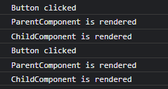
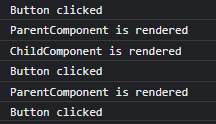

# 基本语法

* 项目创建命令

``` shell
npx create-react-app  projectName
```

* 组件编写

```js
export default function MyComponent () {
    return (
        <div className="my-component">
            我是组件
        </div>
    )
}
```

> 组件函数必须要以大写字母开头

* jsx 规则

1. 只能返回一个根元素，可以使用div包裹也可使用<></>
2. 标签必须闭合
3. 使用驼峰式命名法给 所有 大部分属性命名

* jsx 动态绑定数据

```js
const person = {
    name:'Cooper',
    theme:{
        backgroundColor: 'black',
        color: 'pink'
    }
}
export default function PersonInfo () {
    return (
        <div className="my-component" style={person.theme}>
            <h1>{person.name}</h1>
        </div>
    )
}

```

> 大括号中任何表达式都可以执行
> 当设置css属性或者是对象的时候需要使用双大括号

* 父子组件之间传值

```js
// 此处name 可以解构出来
function Person(props){
    return (
        <div>
            {props.name}
        </div>
    )
}

// 第一种传值
export default function Card (){
    const info = {
        name:'Cooper'
    }
    return (
        <div className="Card">
            <Person name={info.name}/>
        </div>
    )
}

// 第二种传值
export default function Card (){
    const info = {
        name:'Cooper'
    }
    return (
        <div className="Card">
            <Person {...info}/>
        </div>
    )
}
```

* 插槽

父组件使用props.children 来接受子组件

```js
function Avatar({ person, size }) {
  return (
    
  );
}


function Card({ children }) {
  return (
    <div className="card">
      {children}
    </div>
  );
}

export default function Profile() {
  return (
    <Card>
      <Avatar
        size={100}
        person={{
          name: 'Katsuko Saruhashi',
          imageId: 'YfeOqp2'
        }}
      />
    </Card>
  );
}
```

> 不要轻易在子组件中更改props的值 当你需要交互性时，你可以设置 state

* 条件渲染

```js
function Item({ name, isPacked }) {
  return (
    <li className="item">
      {name} {isPacked ? '✔' : 'x'}
    </li>
  );
}

export default function App() {
  return (
    <section>
      <h1>Sally Ride 的行李清单</h1>
      <ul>
        <Item
          isPacked={true}
          name="宇航服"
        />
        <Item
          isPacked={true}
          name="带金箔的头盔"
        />
        <Item
          isPacked={false}
          name="Tam 的照片"
        />
      </ul>
    </section>
  );
}
```

>除了三元表达式外，也可以使用if...else

* 渲染列表

```js
export default function App() {
  const people = [
    "凯瑟琳·约翰逊: 数学家",
    "马里奥·莫利纳: 化学家",
    "穆罕默德·阿卜杜勒·萨拉姆: 物理学家",
    "珀西·莱温·朱利亚: 化学家",
    "苏布拉马尼扬·钱德拉塞卡: 天体物理学家",
  ];
  return (
    <ul>
      {
        people.map((item, idx) => {
            return <li key={ idx }>{ item }</li>;
        })
      }
    </ul>
  );
}
```

* 事件函数

```js
function Button() {
  const handleClick = () => {
    alert('点击了')
  }

  return <button onClick={handleClick}>测试按钮</button>;
}

export default function App() {
  return <Button></Button>
}

```

> 注意你不应该在jsx中手动的去调用函数  例如：onClick={handleClick()}  这样式是错误的

* 将事件函数作为props传递（子传父）

```js
function Button({ handleClick }) {
  return <button onClick={handleClick}>测试按钮</button>;
}

export default function App() {
  const handleClick = () => {
    alert('点击了')
  }
  return <Button handleClick={handleClick}></Button>;
}
```

* 跨级组件之间通信

通过使用 `React.createContext()` 、`useContext()`、`useReducer()` 组合来实现

```js

import React, { useReducer, useContext } from 'react';

const MyContext = React.createContext();

function dataReducer(state,action) {
  switch (action.type) {
    case 'SET_DATA':
      return action.payload;
    default:
      return state;
  }
}

// 中间组件
function Child1() {
  const { data, dispatch } = useContext(MyContext);

  function handleClick() {
    dispatch({ type: "SET_DATA", payload: "button clicked" });
  }

  return (
    <>
      <p>我是中间组件{data}</p>
      <button onClick={handleClick}>Click me</button>
      <Child2 />
    </>
  );
}

// 最内层组件
function Child2() {
  const { data } = useContext(MyContext);

  return <p>我是最内层组件{data}</p>;
}

export default function App() {
  const [data, dispatch] = useReducer(dataReducer, 'Hello, world');

  return (
    <MyContext.Provider value={{ data, dispatch }}>
      <Child1 />
    </MyContext.Provider>
  );

}
```

* 事件

```js
function Button({ onClick, children }) {
  const handleClick = (e) =>{
    e.stopPropagation();  // 阻止冒泡
    // e.preventDefault();  // 阻止默认事件
    onClick();
  }
  return (
    <button onClick={handleClick}>
      {children}
    </button>
  );
}

export default function Toolbar() {
  return (
    <div className="Toolbar" onClick={() => { alert('你点击了 toolbar ！')}}>
      <Button onClick={() => alert('正在播放！')}>
        播放电影
      </Button>
      <Button onClick={() => alert('正在上传！')}>
        上传图片
      </Button>
    </div>
  );
}

```

* 组件状态 State

```js
import { useState } from "react";

export default function App() {

  const [message, setMessage] = useState("没有改变内容之前")

  return (
    <div>
      <p>{message}</p>
      <button onClick={()=>{setMessage('内容改变了')}}>点击改变内容</button>
    </div>
  );
}
```

* 表单数据双向绑定

```js
import { useState } from 'react';

export default function App() {
  const [value, setValue] = useState('');

  const handleChange = e => {
    setValue(e.target.value)
  };

  const handleSubmit = () => {
    setValue('');
    alert(value)
  }
  return (
    <div>
      <input type="text" value={value} onChange={handleChange} />

      <button onClick={handleSubmit}>提交</button>
    </div>
  );
}
```

* useEffect和useLayoutEffect
函数式组件没有生命周期，可以使用`useEffect`和`useLayoutEffect` 来模拟生命周期

```js
// 组件挂载的时候和组件更新的时候都会执行
useEffect(() => {
    console.log('组件挂载');
})

// 只有组件挂载的时候执行一次，后面都不会执行
useEffect(() => {
    console.log('我只执行一次');
}, []);

// 当组件挂载时，以及依赖更新时执行
useEffect(() => {
    console.log('依赖更新-------------');
}, [value]);

// 组件卸载后执行
useEffect(() => {
    return () => {
        console.log('组件卸载');
    };
});
```

> 总结
>
>1.执行（Mounting）
> * useLayoutEffect(fn) - 在浏览器布局和绘制之前立即执行（类似于 Vue 中的 beforeMount）。
> * useEffect(fn) - 在组件装载后，绘制后延迟一段时间后执行。
> * useEffect(fn, []) - 在组件装载后执行一次。
> * useEffect(fn, [deps]) - 每当依赖项更新时执行。
>
>2.更新（Updating）
> * useLayoutEffect(fn) - 在浏览器布局和绘制之前立即执行（类似于 Vue 中的 beforeUpdate）。
> * useEffect(fn) - 在组件重新渲染后，绘制后延迟一段时间后执行。
> * useEffect(fn, []) - 在组件装载后执行一次。
> * useEffect(fn, [deps]) - 每次重新渲染时都会执行。
>
>3.卸载（Unmounting）
> * useEffect(() => { return () => {} }) - 在组件卸载时执行一次。

* useRef的使用

```js
import { useRef } from 'react';

export default function App() {
  const ref = useRef(0);
  console.log(ref.current);

  const handleClick = () => {
    ref.current = ref.current + 1;
    console.log(ref.current);
  };
  return (
    <div>
      <button onClick={handleClick}>点击我</button>
    </div>
  );
}
```

>注意：组件不会在每次递增时重新渲染。 与`state`一样，React 会在每次重新渲染之间保留 ref。但是，设置 state 会重新渲染组件，更改 ref 不会！
>下面的例子页面不会更新状态，因为页面不会重新渲染组件

```js
import { useEffect, useRef } from 'react';

export default function App() {
  const ref = useRef(0);
  console.log(ref.current);

  const handleClick = () => {
    ref.current = ref.current + 1;
    console.log(ref.current);
  };

  useEffect(() => {
    console.log('组件挂载');
  });
  return (
    <div>
      {ref.current}
      <button onClick={handleClick}>点击我</button>
    </div>
  );
}
```

>何时使用:
>
>* 存储 timeout ID
>* 存储和操作 DOM 元素
>* 存储不需要被用来计算 JSX 的其他对象。

* ref 属性的使用

```js
import { useRef } from "react";
export default function App() {
  const myRef = useRef(null)
  const handleClick = () => {
    myRef.current.focus();
  }

  return (
    <div>
      <input type="text" ref={myRef} />
      <button onClick={handleClick}>聚焦</button>
    </div>
  );
}
```

访问组件
在React中不允许组件访问其他组件的 DOM 节点和自己的子组件。如果想要访问子组件或者其他的组件可以使用`forwardRef` API

```js
import { useRef,forwardRef } from "react";
const Input = forwardRef((props, ref) => {
    return <input {...props} ref={ref}></input>;
 })

export default function App() {
  const myRef = useRef(null)
  console.log(myRef);
  const handleClick = ()=>{
    myRef.current.focus()
  }
  return (
    <>
      <Input ref={myRef}></Input>
      <button onClick={handleClick}>聚焦</button>
    </>
  );
}

```

* useMemo

和vue中的计算属性一样，只有其响应式依赖变化时才会执行它，这意味着只要相关依赖不变化，就不会执行

```js
import { useMemo, useState } from 'react';

export default function App() {
  const [firstName, setfirstName] = useState('John');
  const [lastName, setLastName] = useState('Doe');
  const [count, setCount] = useState(0);


  const expensiveValue = useMemo(() => {
    console.log('我是useMemo');
    return firstName + lastName;
  }, [firstName, lastName]);

  const getname = () => {
    console.log('我是普通函数');
    return firstName + lastName;
  }

  return (
    <div>
      <p>{count}</p>
      <p>name:{ getname()}</p>
      <p>name: {expensiveValue}</p>
      <button onClick={()=>{setfirstName('Cooper')}}>改变名字</button>
      <button onClick={()=>{setCount(1)}}>改变数字</button>
    </div>
  );
}
```

> 当点击改变数字的按钮时，expensiveValue函数不执行，getname函数执行

* useCallback

useCallback的作用是缓存一个函数，使得组件重新render时，该函数不会被重新定义，仅仅是从缓存中取出来。这样可以避免因为函数重新定义导致的额外开销，提升组件的性能。

```js
import { useCallback, useState } from 'react';

const ChildCom = ({ handleClick }) => {
  console.log('ChildComponent is rendered');

  return <button onClick={handleClick}>点击我</button>;
};

export default function App() {
  const [count, setCount] = useState(0);

  console.log('ParentComponent is rendered');

  // const handleClick = useCallback(() => {
  //   setCount(count + 1);
  //   console.log('Button clicked');
  // }, []);

  const handleClick = () => {
    setCount(count + 1);
    console.log('Button clicked');
  };

  return (
    <>
      <p>{count}</p>
      <ChildCom handleClick={handleClick}></ChildCom>
    </>
  );
}
```

>每次点击按钮时出现以下情况说明 `handleClick` 函数被重新创建了
>
>
>
> 当使用`useCallback()` 时 `handleClick` 函数会被缓存下来。 则会出现下面情况。 当追踪依赖的值不变时，子组件不会被重新渲染
>
>